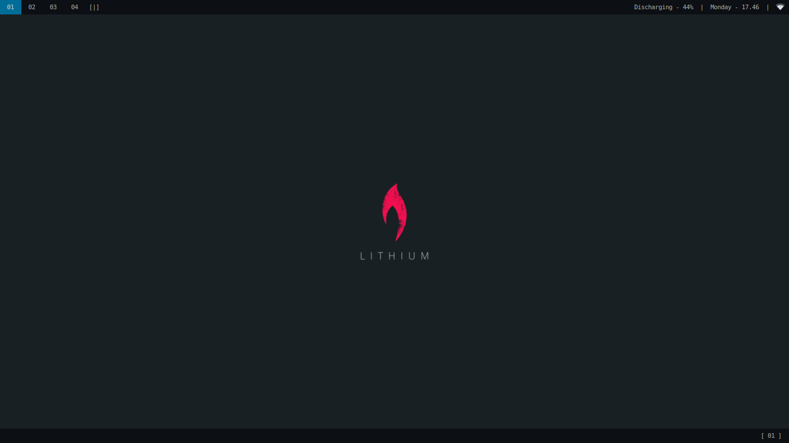
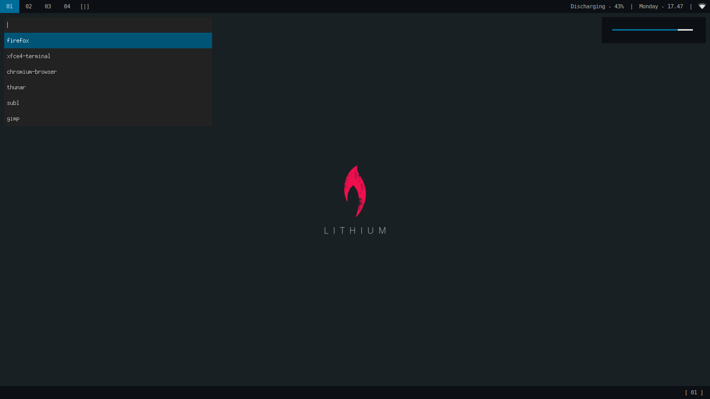
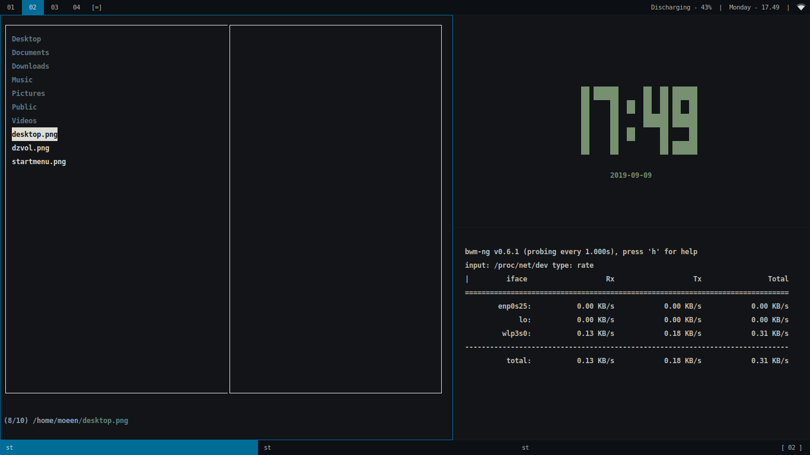
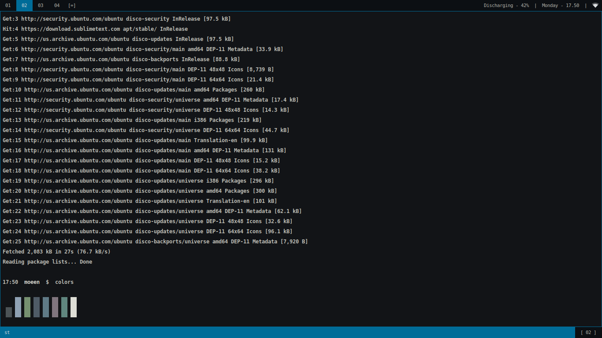

# Dwm Desktop

## About
This is a fork of the suckless dwm v6.2 with added functionality to enable use as a normal desktop. This includes a taskbar, system-tray, ALSA sound manager and a start menu. Complete source code and configurations have been included in this Repository.

## Tools
The following tools and cli-applications can be seen in the above screenshots
* ST v0.8.2 Terminal with usability related patches 
* Dzen2 with sizing related patches
* Startmenu - Dzen2 based startmenu with customizable shortcuts
* Dzvol - Dzen2 based ALSA volume manager
* CFiles - CLI File Manager
* BWM-NG - Network Bandwidth Monitor
* Tty-Clock - CLI Clock
