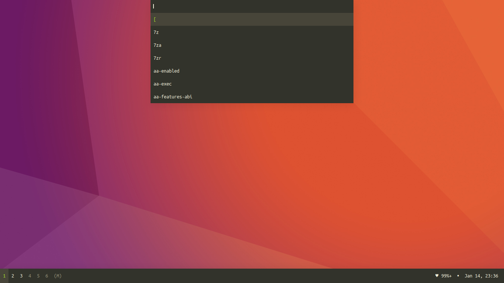
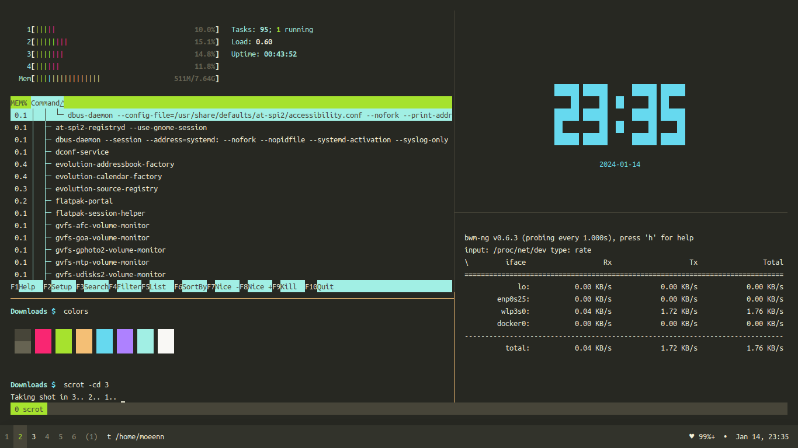

# Dwm Desktop

## About
This is a fork of the suckless dwm v6.4 with added functionality to enable use as a normal desktop. This includes a start menu and a statusbar. Complete source code and configurations have been included in this Repository.

## Tools
The following tools and cli-applications can be seen in the above screenshots
* ST v0.8.2 Terminal with usability related patches
* Dzen2 with sizing related patches
* Startmenu - Dzen2 based startmenu with customizable shortcuts
* BWM-NG - Network Bandwidth Monitor
* Htop - Process monitor
